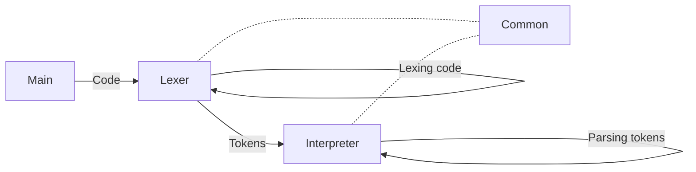

## The $$\mathscr{MAEEL}$$ programming language

Maeel is a {concatenating, esoteric, stack-based, interpreted} programming language.

Important concepts:

- https://en.wikipedia.org/wiki/Stack_machine
- https://en.wikipedia.org/wiki/Reverse_Polish_notation
- https://en.wikipedia.org/wiki/Stack-oriented_programming
- https://en.wikipedia.org/wiki/List_of_mathematical_symbols_by_subject
- https://simple.wikipedia.org/wiki/Greek_alphabet

# Build/run/install maeel

Build: `make build`

Install: `make install`

Run unit tests: `make test`

Execute `maeel [file.maeel]`

# Doc (in dev)

[Click here](docs/README.md)
