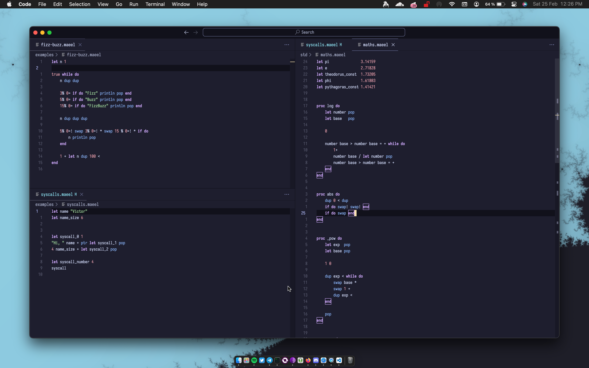

# The maeel programming language



Just like [Forth](https://en.wikipedia.org/wiki/Forth_(programming_language)), **maeel** is a concatenative [stack oriented programming language](https://en.wikipedia.org/wiki/Stack-oriented_programming) built with ~1000 lines of Rust.

## Examples

- [abs(x)](./examples/maths/absolute_value.maeel)
- [sqrt(x)](./examples/maths/square_root.maeel)
- [x^n](./examples/maths/pow.maeel)
- [fizz-buzz](./examples/fizz-buzz.maeel)
- [3x+1](./examples/3x%2B1.maeel)
- [fibonacci](./examples/fibonacci.maeel)

## Hello, world!

Here we push the string `"Hello, world"` on the stack, then call the built-in `print "\n" print pop` function and finally call the built-in stack function `pop` to clear the top stack element (which here is `"Hello, world"`)

```
"Hello, world\n" print pop
```

## VMType

A `VMType` is a type that can be understood by the maeel interpreter. It can be either:

- a String
- an Integer
- a Float
- a Boolean
- a String Pointer
- an Integer Pointer
- an Array

## Arithmetics

A binary operator takes the two first elements of the stack, applies a function on them and then push the function result on the stack.

`2 3 + print` will print `5` (2 + 3)

`2 3 * print` will print `6` (2 * 3)

`3 2 - print` will print `1` (3 - 2)

`3 2 / print` will print `1.5` (3 / 2)

`10 3 % print` will print `1` (10 mod 2)

## Logic

`true true   * print "\n" print pop` will print `true` (true AND true)

`true false  * print "\n" print pop` will print `false` (true AND false)

`false true  * print "\n" print pop` will print `false` (false AND true)

`false false * print "\n" print pop` will print `false` (false AND false)


`true true   + print "\n" print pop` will print `true` (true OR true)

`true false  + print "\n" print pop` will print `true` (true OR false)

`false true  + print "\n" print pop` will print `true` (false OR true)

`false false + print "\n" print pop` will print `false` (false OR false)

## Other operators

`false! print "\n" print pop` will print `true` (NOT false)

`true! print "\n" print pop` will print `false` (NOT true)

`<obj> <obj> = print "\n" print pop` has the equivalent in Python: `print(<obj> == <obj>)`

There is also `<`, `>`, but no `<=` and `>=`, which you need to implement yourself using `OR` operator:

`5 10 < 5 10 = + print "\n" print pop` has the equivalent in Python: `print(5 <= 10)`

Note you can use optional (they are removed at tokenization) parenthesis for better code comprehension:

`5 10 < 5 10 = + print "\n" print pop` has the equivalent: `(5 10 <) (5 10 =) + print "\n" print pop`

## Code block

A code block is all the code contained between a `do` and a `end` keyword.
For example `do "Hello" print "\n" print pop pop end`.
Note that you can use nested code blocks, for example:

```
do
    1+1 print "\n" print pop
    do
        "hello\n" print pop
    end
end
```

It doesn't make any sense to use code block in the previous examples, but I needed to explain it for the next chapters.

## Conditions

A condition will execute if, and only if, there is a `true` value on top of the stack.
It's followed by a code block which determine which instructions will be executed.

```
true if do
    "Condition met!\n" print pop
end
```

## Variables

A variable links a name to a `VMType` (String, Integer, Float, Boolean, Array, StringPTR, IntPTR)
To define a new variable, use `let` keyword:

`let <name> <value>`, `let hello "Hello"`

You can also use stack functions:

`"Hello" let hello pop` or `"Hello" let hello dup` or  `"Hello" 123 let hello over`

## For loops and arrays

An array is defined using the `take` keyword:

`<element 1> <element 2> ... <element n> n take let array pop`,

`(1 2 3 4) 4 take let array pop`,

`"foo" (2.1 "bar" 4) 3 take let array pop`

For loop take each array element, push it on the stack and then execute the next code block for each element:

```
<array> for do
    <instructions>
end
```

```
(1 2 3) 3 take let array pop

array for do
    print "\n" print pop
end
```
