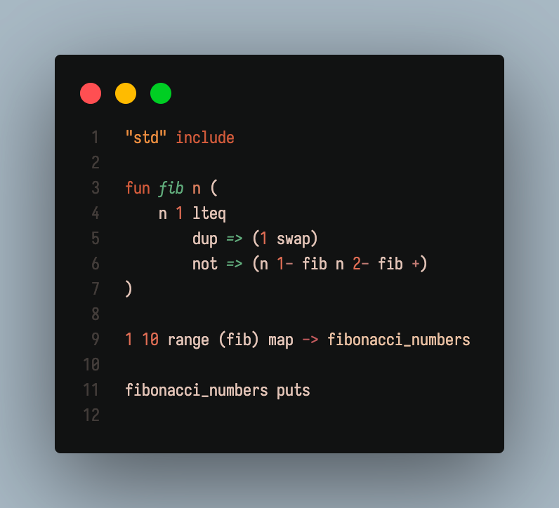

# maeel

### a minimalistic stack based programming language.

The interpreter (including lexer) is made up of 500 lines of code.

## Compile

`$ make test` (c.f. [tests.maeel](./stdlib/tests.maeel))

`$ make bench`

`$ make`

## Run program

`$ ./maeel program.maeel`

## Implemented in maeel

- Stack functions (drop, dup, rot, over, swap)
- Booleans functions (and, or, not)
- Conditions (ifelse, then)  (s/o Turring)
- Loops (while, for)
- Lists definition (List ... end)

