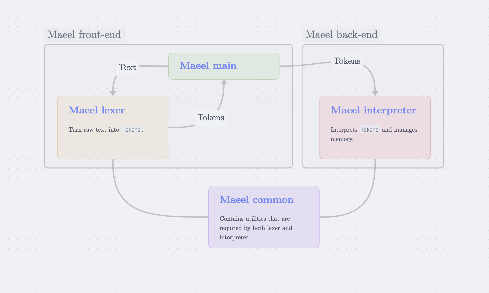

# The Maeel programming language



Maeel is a {concatenating, esoteric, stack-based, interpreted} programming language.

---
Important concepts:

- https://en.wikipedia.org/wiki/Stack_machine
- https://en.wikipedia.org/wiki/Reverse_Polish_notation
- https://en.wikipedia.org/wiki/Stack-oriented_programming

- https://en.wikipedia.org/wiki/List_of_mathematical_symbols_by_subject
- https://simple.wikipedia.org/wiki/Greek_alphabet

---
The interpreter is < 300 LoC thanks to recursion and simplicity of concatenation.

# Build/Run/Install maeel

Build: `make build`

Install: `make install`

Run unit tests: `make test`

Execute `maeel [file.maeel]`

# Patterns

## Variable definition

`→ name` will set the "name" alias to the value on the top of the stack.

Example:

```
3.14 → pi

pi print
```

## Function definition

`λ name [argument] (code)` will set the "name" alias to the next code block.

Example:

```
λ square [x] (
    x x *
)

2 square print
```

## If

`⇒ (code)` will execute "code" if, and only if the stack top value is `true`

Example:

`a b = ⇒ ("a and b are equal!" print)`

## While loop

`ω (code)` will loop executing "code" while there is a `true` on the stack top. Note: the "code" needs to output a boolean at its end to define if it will continue looping or not.

Example:

```
1 → a

a 100 < ω (
    a print
    a 1 + → a

    a 100 <
)
```

## For loop

`Ω (code)` will push(value) for all value elements of stack top (stack top must be an array) and then execute the next code block

# Operators

## Stack functions

| Symbol | Definition         |
|---     |---                 |
| `ρ`    | `a b c -- a b`     |
| `σ`    | `a b c -- a c b`   |
| `ψ`    | `a b c -- c a b`   |
| `δ`    | `a b c -- a b c c` |
| `θ`    | `a b c -- a b c b` |

## Arithmetic

| Symbol | Definition       | Commutative |
|---     |---               |---          |
| `+`    | `x y -- (x + y)` | yes         |
| `-`    | `x y -- (x - y)` | no          |
| `*`    | `x y -- (x * y)` | yes         |
| `/`    | `x y -- (x / y)` | no          |
| `%`    | `x y -- (x % y)` | no          |
| `!`    | `x -- (-x)`      | n/a         |

## Logic

| Symbol | Definition         | Commutative |
|---     |---                 |---          |
| `∧`    | $$\set {p, q} \mapsto \set {p \land q}$$ | yes         |
| `∨`    | $$\set {p, q} \mapsto \set {p \lor q}$$  | yes         |
| `⊕`    | $$\set {p, q} \mapsto \set {p \oplus q}$$ | yes         |
| `¬`    | $$\set {p} \mapsto \set {\lnot p}$$     | n/a         |

## Comparison

| Symbol | Definition          | Commutative |
|---     |---                  |---          |
| `=`    | `a b -- (a = b)`    | yes         |
| `≠`    | `a b -- (¬(a = b))` | yes         |
| `>`    | `a b -- (a > b)`    | no          |
| `<`    | `a b -- (a < b)`    | no          |
| `⩽`    | `a b -- (a ⩽ b)`    | no          |
| `⩾`    | `a b -- (a ⩾ b)`    | no          |

## Arrays

| Symbol | Definition         | Commutative |
|---     |---                 |---          |
| `∪`    | $$\set{\mathbb{A}, \mathbb{B}} \mapsto \set{\mathbb{A}\cup\mathbb{B}} $$   | yes         |
| `+`    | $$\set{a, \mathbb{A}} \mapsto \set{\set{a}\cup\mathbb{A}}$$ | yes         |
| `*`    | $$\set{\mathbb{A}, \mathbb{B}} \mapsto \set{\mathbb{A}\times\mathbb{B}}$$
| `Σ`    | $$\set{\mathbb{A}} \mapsto \set{\sum_{n=0}^{\vert \mathbb{A}\vert} \mathbb{A}_n}$$ | no |
| `Π`    | $$\set{\mathbb{A}} \mapsto \set{\prod_{n=0}^{\vert \mathbb{A}\vert} \mathbb{A}_n}$$ | no |

## Constants

| Symbol | Type     | Value     |
|---     |---       |---        |
| `α`    | `bool`   | `true`    |
| `β`    | `bool`   | `false`   |
| `ε`    | `string` | `""`      |
| `π`    | `float`  | `3.14...` |
| `∅`    | `array`  | `{}`      |