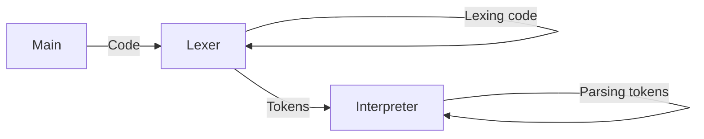

# The $$\mathscr{MAEEL}$$ programming language



Maeel is a {concatenating, esoteric, stack-based, interpreted} programming language.

---
Important concepts:

- https://en.wikipedia.org/wiki/Stack_machine
- https://en.wikipedia.org/wiki/Reverse_Polish_notation
- https://en.wikipedia.org/wiki/Stack-oriented_programming

- https://en.wikipedia.org/wiki/List_of_mathematical_symbols_by_subject
- https://simple.wikipedia.org/wiki/Greek_alphabet

---
The interpreter is < 300 LoC thanks to recursion and simplicity of concatenation.

# Build/Run/Install maeel

Build: `make build`

Install: `make install`

Run unit tests: `make test`

Execute `maeel [file.maeel]`

# Operators

## Stack functions

| Symbol | Definition         |
|---     |---                 |
| `ρ`    | $$\set{a,b,c}\rightarrow\set{a,b}$$ |
| `σ`    | $$\set{a,b,c}\rightarrow\set{a,c,b}$$ |
| `ψ`    | $$\set{a,b,c}\rightarrow\set{c,a,b}$$ |
| `δ`    | $$\set{a,b,c}\rightarrow\set{a,b,c,c}$$ |
| `θ`    | $$\set{a,b,c}\rightarrow\set{a,b,c,b}$$ |

## Arithmetic

| Symbol | Definition       |
|---     |---               |
| `+`    | $$\set{a,b}\rightarrow\set{a+b}$$
| `-`    | $$\set{a,b}\rightarrow\set{a-b}$$
| `*`    | $$\set{a,b}\rightarrow\set{a\times{b}}$$
| `/`    | $$\set{a,b}\rightarrow\set{\frac{a}{b}}$$
| `%`    | $$\set{a,b}\rightarrow\set{a\mod{b}}$$
| `!`    | $$\set{a}\rightarrow\set{-a}$$
| `∣`    | $$\set{a,b}\rightarrow\set{a\equiv0\mod{b}}$$
| `∤`    | $$\set{a,b}\rightarrow\set{\lnot(a\equiv0\mod{b})}$$

## Logic

| Symbol | Definition         |
|---     |---                 |
| `∧`    | $$\set{p,q}\rightarrow\set{p\land{q}}$$
| `∨`    | $$\set{p,q}\rightarrow\set{p\lor{q}}$$
| `⊕`    | $$\set{p,q}\rightarrow\set{p\oplus{q}}$$
| `¬`    | $$\set{p}\rightarrow\set{\lnot{p}}$$

## Comparison

| Symbol | Definition          |
|---     |---                  |
| `=`    | $$\set{a,b}\rightarrow\set{a=b}$$
| `≠`    | $$\set{a,b}\rightarrow\set{a\neq{b}}$$
| `>`    | $$\set{a,b}\rightarrow\set{a\gt{b}}$$
| `<`    | $$\set{a,b}\rightarrow\set{a\lt{b}}$$
| `⩽`    | $$\set{a,b}\rightarrow\set{a\geq{b}}$$
| `⩾`    | $$\set{a,b}\rightarrow\set{a\leq{b}}$$

## Arrays

| Symbol | Definition         |
|---     |---                 |
| `∪`    | $$\set{\mathbb{A},\mathbb{B}}\rightarrow\set{\mathbb{A}\cup\mathbb{B}}$$
| `+`    | $$\set{a,\mathbb{A}}\rightarrow\set{\set{a}\cup\mathbb{A}}$$
| `*`    | $$\set{\mathbb{A},\mathbb{B}}\rightarrow\set{\mathbb{A}\times\mathbb{B}}$$
| `Σ`    | $$\set{\mathbb{A}}\rightarrow\set{\sum_{n=0}^{\vert\mathbb{A}\vert}\mathbb{A}_n}$$
| `Π`    | $$\set{\mathbb{A}}\rightarrow\set{\prod_{n=0}^{\vert\mathbb{A}\vert}\mathbb{A}_n}$$
| `#`    | $$\set{\mathbb{A}}\rightarrow\set{\sum_{0}^{\vert\mathbb{A}\vert}1}$$

## Constants

| Symbol | Type     | Value     |
|---     |---       |---        |
| `α`    | `bool`   | `true`    |
| `β`    | `bool`   | `false`   |
| `ε`    | `string` | `""`      |
| `π`    | `float`  | `3.14...` |
| `∅`    | `array`  | `{}`      |

# Patterns

## Variable definition

`→ name` will set the "name" alias to the value on the top of the stack.

Example:

```
3.14 → pi

pi print
```

## Function definition

`λ name [argument] (code)` will set the "name" alias to the next code block.

Example:

```
λ square [x] (
    x x *
)

2 square print
```

## If

`⇒ (code)` will execute "code" if, and only if the stack top value is `true`

Example:

`a b = ⇒ ("a and b are equal!" print)`

## While loop

`ω (code)` will loop executing "code" while there is a `true` on the stack top. Note: the "code" needs to output a boolean at its end to define if it will continue looping or not.

Example:

```
1 → a

a 100 < ω (
    a print
    a 1 + → a

    a 100 <
)
```

## For loop

`Ω (code)` will push(value) for all value elements of stack top (stack top must be an array) and then execute the next code block
